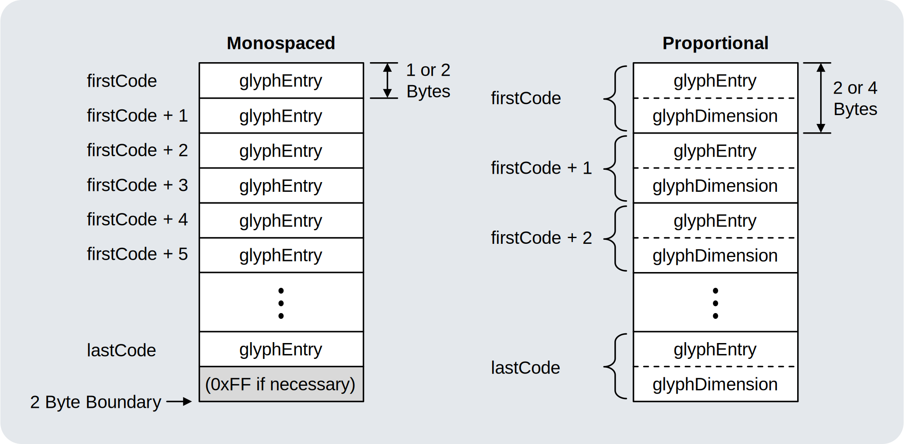
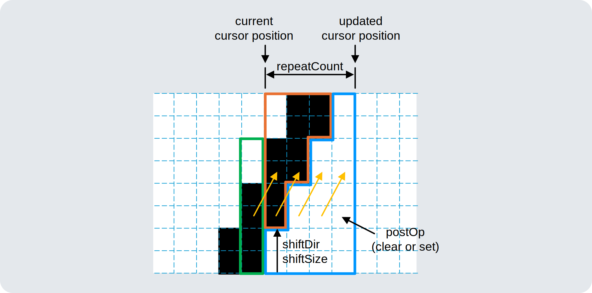

# [WIP] MameFont

Compressed font format specification and library for tiny-footprint embedded projects.

"Mame" (まめ, 豆) means "bean(s)" in Japanese.

> [!WARNING]
> The specifications are currently under development and may change without notice.

# Concept

## Glyph Fragmentation

### Fragment Encoding

|Pixel Format|Pixel Order|Near Pixel|...|Far Pixel|
|:--:|:--:|:--:|:--:|:--:|
|1 bit/pixel|Near Pixel First|bit\[0\]|...|bit\[7\]|
|1 bit/pixel|Far Pixel First|bit\[7\]|...|bit\[0\]|
|2 bit/pixel|Near Pixel First|bit\[1:0\]|...|bit\[7:6\]|
|2 bit/pixel|Far Pixel First|bit\[7:6\]|...|bit\[1:0\]|

# Format Specification

## Blob Structure

|Size \[Bytes\]|Name|
|:--|:--|
|8|Font Header|
|(Variable)|Extended Header|
|(1, 2, or 4) \* (number of glyphs)|Glyph Table|
|`fragmentTableSize`|Fragment Table|
|(Variable)|Bytecode Blocks|

## Font Header

A structure that provides information common to the entire font.

|Byte Offset|Bit Range|Value|
|:--:|:--:|:--|
|0|7:4|(Reserved)|
||3:0|`formatVersion`|
|1|7:0|`fontFlags`|
|2|7:0|`firstCode`|
|3|7:0|`lastCode`|
|4|7:5|(Reserved)||
||4:0|`fragmentTableSize` / 2 - 1|
|5|7:6|(Reserved)|
||5:0|`maxGlyphWidth` - 1|
|6|7:6|(Reserved)|
||5:0|`glyphHeight` - 1|
|7|7:4|`xMonoSpacing`|
||3:0|`ySpacing`|

### `formatVersion`

The format version of the font. Its value must be 0x1.

### `fontFlags`

`fontFlags` provides basic flags for the format of the font file.

|Bit Range|Value|Description|
|:--:|:--|:--|
|7|`verticalFragment`|0: Horizontal Fragment, 1: Vertical Fragment|
|6|`farPixelFirst`|0: LSB=Near Pixel, 1: LSB=Far Pixel|
|5:4|`pixelFormat`|0: 1 bit/pixel, 1: 2 bit/pixel, 3: Reserved, 4: Reserved|
|3|0|(Reserved)|
|2|`largeFont`|0: Small Size Format for Glyph Table, 1: Normal Size Format for Glyph Table|
|1|`proportional`|0: Monospaced Format for Glyph Table, 1: Proportional Format for Glyph Table|
|0|`hasExtendedHeader`|0: No Extended Header, 1: Extended Header exists|

### `firstCode` / `lastCode`

ASCII code of the first/last entry of Glyph Table. `firstCode` must not exceed `lastGlyphs`.

### `fragmentTableSize`

Number of entries of Fragment Table. Must be in the range 2 ≦ `fragmentTableSize` ≦ 64 and a multiple of 2.

### `maxGlyphWidth`

In monospaced fonts, `maxGlyphWidth` is the common width of all glyphs. In proportional fonts, `maxGlyphWidth` is `glyphWidth` value of widest glyph. Decoder can use this to determine size of Glyph Buffer. If the font does not contain any valid glyphs, then `maxGlyphWidth` must have a value of 1 (`fontDimension[0]` = 0x00).

### `glyphHeight`

Height of glyph in pixels. `glyphHeight` + `ySpacing` is same as `yAdvance` of GFXfont.

### `xMonoSpacing`

In monospaced fonts, `xMonoSpacing` is distance in pixels from the right edge of the current glyph to the left edge of the next glyph. In proportional fonts, this should be ignored.

### `ySpacing`

Distance in pixels from the bottom of the current line to the top of the next line.

## Extended Header

Extended Header are not allowed in the current version. If the `hasExtendedHeader` flag is 1, the decoder must read only `extHeaderSize` and ignore the rest.

|Byte Offset|Bit Range|Value|
|:--:|:--:|:--|
|0|7:0|`extHeaderSize` / 2 - 1|
|1 ... (`extHeaderSize` - 1)|-|(Reserved)|

### `extHeaderSize`

Number of bytes from the beginning to the end of the Extended Header. `extHeaderSize` includes its own size. The range is 2 ≤ `extHeaderSize` ≤ 512 and must be a multiple of 2.

## Glyph Table

The glyph table provides the bytecode entry points for each glyph and, in proportional fonts, the horizontal dimension of each glyph.

There are four glyph table formats depending on the combination of the `largeFont` and `proportional` flags.

|`largeFont`|`proportional`|Format Name|
|:--:|:--:|:--|
|0|0|Small Monospaced Format|
|0|1|Small Proportional Format|
|1|0|Normal Monospaced Format|
|1|1|Normal Proportional Format|

The Small Format (`largeFont` = 0) can be applied when all of the following conditions are met:

- 1 ≦ `glyphWidth` ≦ 16 for all glyphs.
- 0 ≦ `xSpacing` ≦ 3 for all glyphs.
- 0 ≦ `xStepBack` ≦ 3 for all glyphs.
- 0 ≦ `entryPoint` ≦ 509 for all glyphs.

For Small Format, all of `entryPoint` must be aligned to 2-Byte boundaries.

In the monospaced format, the width of each glyph is specified by `maxGlyphWidth`, and the spacing between characters is specified by `xMonoSpacing`.

The size of the glyph table must be a multiple of 2 bytes. If the total size of each field does not reach a 2-byte boundary, padding must be inserted at the end. The padding value must be 0xFF.

### `glyphEntry`

#### Small Format

|Byte Offset|Bit Range|Value|
|:--:|:--:|:--|
|0|7:0|`entryPoint` / 2|

`glyphEntry` = 0xFF (`entryPoint` = 0x1FE) indicates a missing glyph.

#### NormalFormat

|Byte Offset|Bit Range|Value|
|:--:|:--:|:--|
|0|7:0|`entryPoint[7:0]`|
|1|7:6|(Reserved)|
||5:0|`entryPoint[13:8]`|

`glyphEntry` = 0xFFFF indicates a missing glyph.

#### `entryPoint`

Offset from start of Bytecode Block in bytes.

### `glyphDimension`

#### Small Format

|Byte Offset|Bit Range|Value|
|:--:|:--:|:--|
|0|7:6|`xStepBack`|
||5:4|`xSpacing`|
||3:0|`glyphWidth` - 1|

#### NormalFormat

|Byte Offset|Bit Range|Value|
|:--:|:--:|:--|
|0|7:6|(Reserved)|
||5:0|`glyphWidth` - 1|
|1|7:5|`xStepBack`|
||4:0|`xSpacing` + 16||

`glyphWidth` - `xStepBack` + `xSpacing` is same as `xAdvance` of GFXfont. Depending on these values, rendered characters can overlap, but it is up to the renderer implementation to render this as the font designer expected.

#### `glyphWidth`

Glyph width in pixels.

#### `xStepBack`

The glyph is rendered shifted to the left by the number of pixels specified by this value.

#### `xSpacing`

Distance in pixels from the right edge of the current glyph to the left edge of the next glyph.

### Missing Glyph

To express that no valid glyph is assigned to a character code, all bytes of `glyphEntry` should be 0xFF.

How the missing glyph is rendered is up to the renderer implementation.

## Fragment Table

The Fragment Table provides the fragments of the glyph in bytes.

The same fragment is allowed to appear multiple times in the fragment table.

If the total size does not reach a 2-Byte boundary, a padding byte must be appended.
The value of `fragmentTableSize` includes this padding byte.

## Bytecode Block

A Bytecode Block is the concatenation of all glyph bytecodes. When a Shrinked Glyph Table is applied, the first instruction in each glyph is aligned to a 2-byte boundary, but subsequent instructions are placed immediately after the previous instruction.

|Size \[Bytes\]|Description|
|:--:|:--|
|(Variable)|Array of instructions|

# Instruction Set

## Summary

Each instruction consists of 1 to 3 bytes. The first byte is the "OpCode", and the following bytes are parameters.

### OpCode Map

The number in parentheses indicates the length of the instruction in bytes.

## Single Lookup (`LUP`)

|Byte Offset|Bit Range|Value|
|:--:|:--:|:--|
|1|7:6|0b10|
||5:0|`index`|

The state machine simply copies the fragment in the Fragment Table to the glyph buffer. If farPixelFirst=1 is set, the fragments in the Fragment Table must also be Far Pixel 1st.

## Double Lookup (`LUD`)

|Byte|Bit Range|Value|
|:--:|:--:|:--|
|1|7:5|0b110|
||4|`step`|
||3:0|`index`|

## Load Immediate (`LDI`)

|Byte|Bit Range|Value|
|:--:|:--:|:--|
|1|7:0|0x60|
|2|7:0|Fragment|

The state machine simply copies the second byte of the instruction code into the glyph buffer. If farPixelFirst=1 is set, the fragment in the instruction code must also be Far Pixel 1st.

## Repeat Last Fragment (`RPT`)

|Byte|Bit Range|Value|
|:--:|:--:|:--|
|1|7:4|0b1110|
||3:0|`repeatCount` - 1|

## Shift Last Fragment (`SFT`)

|Byte|Bit Range|Value|
|:--:|:--:|:--|
|1|7:6|0b00|
||5|`shiftDir` (0: Left, 1: Right)|
||4|`postOp` (0: Clear, 1: Set)|
||3:2|`shiftSize` - 1|
||1:0|`repeatCount` - 1|

When `shiftDir`=0, SFT shifts the fragment towards the LSB direction, other is the opposite.

## Shift Last Fragment with Intervals (`SFI`)

|Byte|Bit Range|Value|
|:--:|:--:|:--|
|1|7:0|0x68|
|2|7:6|`period` - 2|
||5|`shiftDir` (0: Left, 1: Right)|
||4|`postOp` (0: Clear, 1: Set)|
||3|`preShift`|
||2:0|`repeatCount` - 1|

## XOR Last Fragment with Mask (`XOR`)

|Byte|Bit Range|Value|
|:--:|:--:|:--|
|1|7:4|0b1111|
||3|`maskWidth - 1`|
||2:0|`maskPos`|

Combination of `maskWidth=2` and `maskPos=7` (0xFF) is reserved for other instruction or future use.

## Copy Recent (`CPY`)

|Byte|Bit Range|Value|
|:--:|:--:|:--|
|1|7:6|0b01|
||5|`byteReverse`|
||4:3|`offset`|
||2:0|`length` - 1|

- for `byteReverse` = 0: Combination of `offset=0` and `length=1` (0x40) is reserved for other instruction or future use.
- for `byteReverse` = 1: `length=1` (0x60, 0x68, 0x70, 0x78) is reserved for other instruction or future use.

## Long Distance Large Copy (`CPX`)

|Byte|Bit Range|Value|
|:--:|:--:|:--|
|1|7:0|0x40|
|2|7:0|`offset[7:0]`|
|3|7|`pixelReverse`|
||6|`byteReverse`|
||5:2|(`length` / 4) - 4|
||1|`inverse`|
||0|`offset[8]`|

## Abort (`ABO`)

|Byte|Bit Range|Value|
|:--:|:--:|:--|
|1|7:0|0xFF|

The decoder must abort decompression when it encounters an `ABO` instruction.

If safety is a priority, the blob generator can add a `ABO` instruction to the end of the glyph bytecode. This instruction is normally never executed, since decompression finishes as soon as the glyph buffer is filled. However, if the blob or decoder logic is corrupted, this instruction can stop a runaway decompression process.

If a Shrinked Glyph Table is applied and the length of the glyph bytecode sequence does not reach a 2-byte boundary, it is recommended that the remaining part be filled with this instruction.

It is recommended to place three `ABO` instructions at the end of Bytecode Block, i.e. at the end of the entire blob.

# Rendering

## Buffer Model

