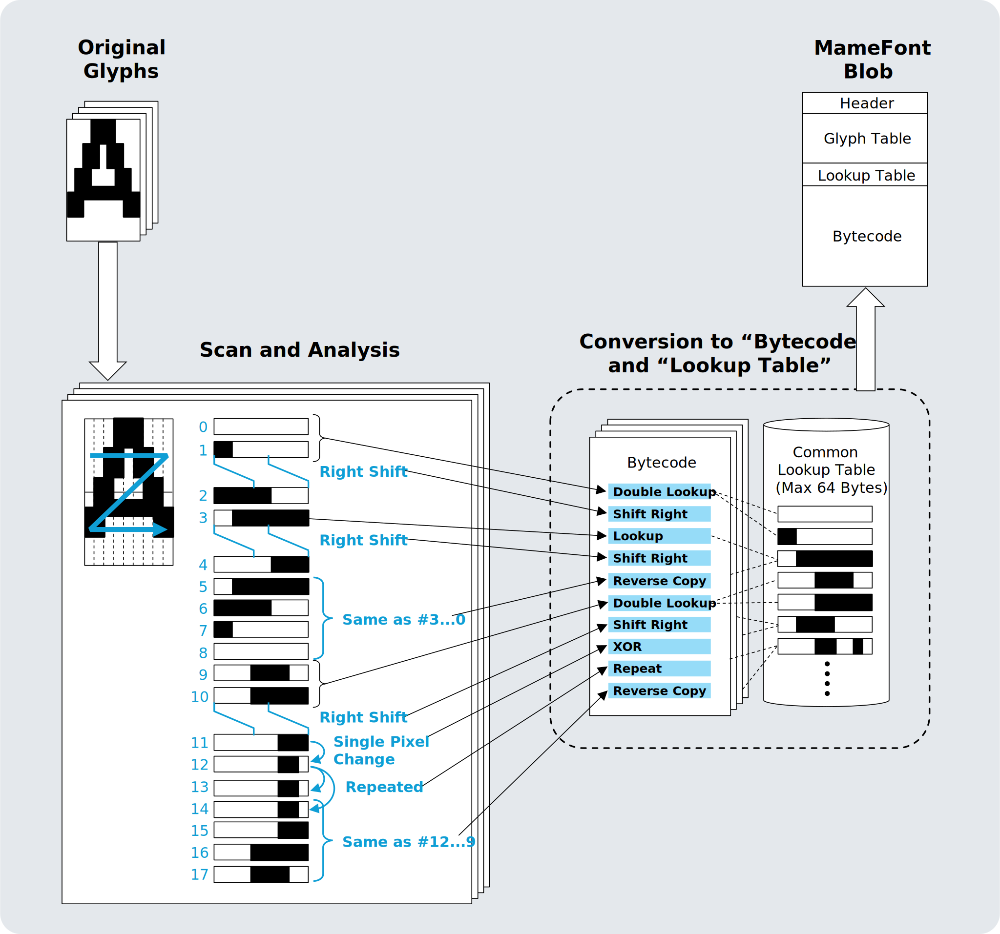
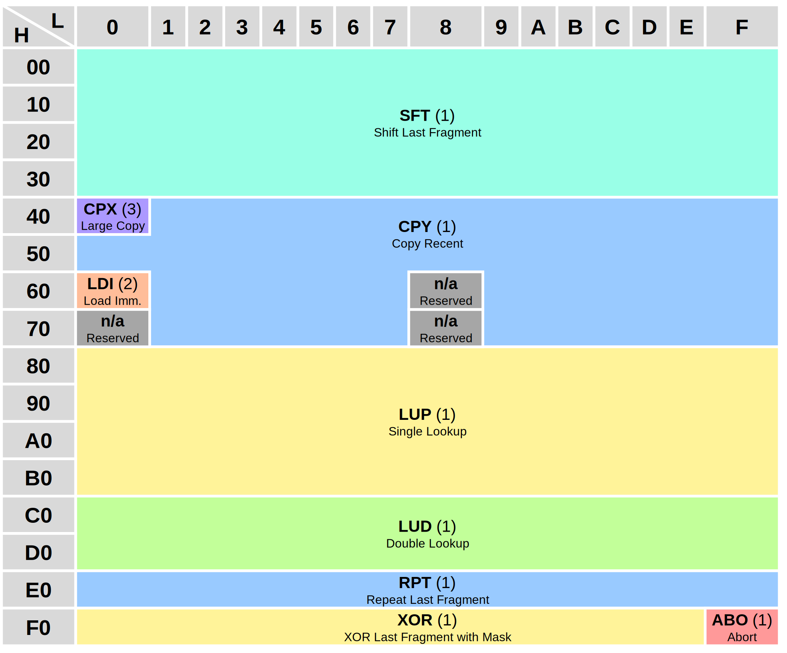
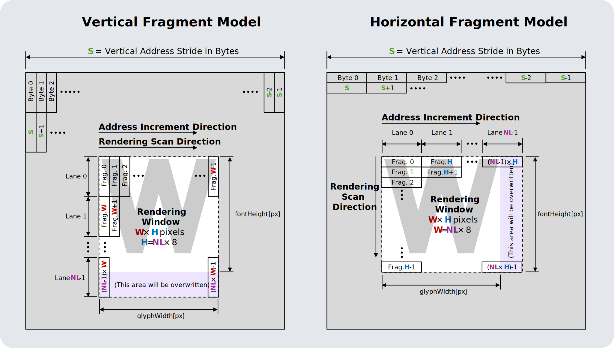

# [WIP] MameFont

Compressed font format specification and library for tiny-footprint embedded projects.

"Mame" (まめ, 豆) means "bean(s)" in Japanese.

# Concept




# Format Specification

## Blob Structure

|Size \[Bytes\]|Name|
|:--:|:--|
|8|Font Header|
|(4 or 2) \* `numGlyphs`|Glyph Table|
|`lutSize`|Fragment Lookup Table (LUT)|
|(Variable)|Bytecode Blocks|

## Font Header

A structure that provides information common to the entire font.

|Size \[Bytes\]|Value|Description|
|:--:|:--|:--|
|1|`formatVersion`|0x01|
|1|`fontFlags`|Format Flags|
|1|`firstCode`|ASCII code of the first entry of Glyph Table|
|1|`numGlyphs` - 1|`numGlyphs` is number of entries of Glyph Table|
|1|`lutSize` - 1|`lutSize` is number of entries of LUT.<br>2 ≦ `lutSize` ≦ 64, and multiple of 2|
|1|`fontDimension[0]`|Dimension of Font|
|1|`fontDimension[1]`|Dimension of Font|
|1|`fontDimension[2]`|Dimension of Font|

### `fontFlags`

`fontFlags` provides basic flags for the format of the font file.

|Bit Range|Value|Description|
|:--:|:--|:--|
|7|`verticalFragment`|0: Horizontal Fragment,<br>1: Vertical Fragment|
|6|`msb1st`|0: LSB=Near Pixel,<br>1: LSB=Far Pixel|
|5|`shrinkedGlyphTable`|0: Normal Format,<br>1: Shrinked Format|
|4:0|(Reserved)||


### `fontDimension`

|Index|Bit Range|Value|Description|
|:--:|:--:|:--|:--|
|\[0\]|7:6|(Reserved)||
||5:0|`fontHeight` - 1|`fontHeight` is height of glyph in pixels|
|\[1\]|7:6|(Reserved)||
||5:0|`yAdvance` - 1|`yAdvance` is the distance in pixels from the top of the current line to the top of the next line|
|\[2\]|7:6|(Reserved)||
||5:0|`maxGlyphWidth` - 1|`maxGlyphWidth` is `glyphWidth` value of widest glyph in the font|

`yAdvance` may be smaller than `fontHeight`, but whether it is rendered as intended by the font designer depends on the implementation of the graphics engine.

## Glyph Table

### Normal Table Entry (4 Byte)

|Size \[Bytes\]|Value|Description|
|:--:|:--|:--|
|2|`entryPoint`|Offset from start of Bytecode Block in bytes|
|1|`glyphDimension[0]`|Dimension of the glyph|
|1|`glyphDimension[1]`|Dimension of the glyph|

#### `glyphDimension`

|Index|Bit Range|Value|Description|
|:--:|:--:|:--|:--|
|\[0\]|7:6|(Reserved)||
||5:0|`glyphWidth` - 1|`glyphWidth` is glyph width in pixels|
|\[1\]|7:6|(Reserved)||
||5:0|`xAdvance` - 1|`xAdvance` is the distance in pixels from the left edge of the current character to the left edge of the next character|

`xAdvance` may be smaller than `glyphWidth`, but whether it is rendered as intended by the font designer depends on the implementation of the graphics engine.

### Shrinked Table Entry (2 Byte)

The Shrinked Format of the Glyph Table can be applied when all glyphWidth and xAdvance in the font are 16 pixel or less, and the total size of the bytecode block is 512 Byte or less. In this case, all bytecode entry points must be aligned to 2-Byte boundaries.

|Size \[Bytes\]|Value|Description|
|:--:|:--|:--|
|1|`entryPoint` &gt;&gt; 1|The value of entryPoint divided by 2. The true value of entryPoint must be a multiple of 2.|
|1|`packedGlyphDimension`|Dimension of the glyph|

#### `packedGlyphDimension`

|Bit Range|Value|Description|
|:--:|:--|:--|
|7:4|`xAdvance` - 1|See description of Normal Table Entry.|
|3:0|`glyphWidth` - 1|See description of Normal Table Entry.|

### Missing Glyph

To express that no valid glyph is assigned to a character code, the first two bytes of the Glyph Table Entry should be 0xFFFF.

This also means:

- If not a Shrinked Glyph Table: entryPoint=0xFFFF cannot be used.
- If a Shrinked Glyph Table: the combination of entryPoint=0x1FE, glyphWidth=16, xAdvance=16 cannot be used.

Be careful as these can lead to corner case issues.

## Lookup Table

If the total size does not reach a 2-Byte boundary, a dummy byte must be appended.
The value of `lutSize` includes this dummy byte.

## Bytecode Block

A Bytecode Block is the concatenation of all glyph bytecodes. If a Shrink Glyph Table is applied, the start of each glyph bytecode must be aligned to a 2-byte boundary.

|Size \[Bytes\]|Description|
|:--:|:--|
|(Variable)|Array of instructions|

# Instruction Set

## Summary



## Single Lookup (`LUP`)

|Byte|Bit Range|Value|
|:--:|:--:|:--|
|1st.|7:6|0b10|
||5:0|`index`|

The state machine simply copies the fragment in the LUT to the glyph buffer. If msb1st=1 is set, the fragments in the LUT must also be MSB 1st.


### Pseudo Code

```c
buff[cursor++] = lut[index];
```

## Double Lookup (`LUD`)

|Byte|Bit Range|Value|
|:--:|:--:|:--|
|1st.|7:5|0b110|
||4|`step`|
||3:0|`index`|


### Pseudo Code

```c
buff[cursor++] = lut[index];
buff[cursor++] = lut[index + step];
```

## Load Immediate (`LDI`)

|Byte|Bit Range|Value|
|:--:|:--:|:--|
|1st.|7:0|0x60|
|2nd.|7:0|Fragment|

The state machine simply copies the second byte of the instruction code into the glyph buffer. If msb1st=1 is set, the fragment in the instruction code must also be MSB 1st.


### Pseudo Code

```c
buff[cursor++] = bytecode[programCounter++];
```

## Repeat Last Fragment (`RPT`)

|Byte|Bit Range|Value|
|:--:|:--:|:--|
|1st.|7:4|0b1110|
||3:0|`repeatCount` - 1|


### Pseudo Code

```c
memset(buff + cursor, buff[cursor - 1], repeatCount);
cursor += repeatCount;
```
## Shift Last Fragment (`SFT`)

|Byte|Bit Range|Value|
|:--:|:--:|:--|
|1st.|7:6|0b00|
||5|`shiftDir` (0: Left, 1: Right)|
||4|`postOp` (0: Clear, 1: Set)|
||3:2|`shiftSize` - 1|
||1:0|`repeatCount` - 1|

When `shiftDir`=0, SFT shifts the fragment towards the LSB direction, other is the opposite.


### Visual direction of pixel movement

|`verticalFragment`|`msb1st`|`shiftDir`=0|`shiftDir`=1|
|:--:|:--:|:--:|:--:|
|0 (Horizontal)|0 (LSB first)|Right|Left|
|0 (Horizontal)|1 (MSB first)|Left|Right|
|1 (Vertical)|0 (LSB first)|Down|Up|
|1 (Vertical)|1 (MSB first)|Up|Down|

### Pseudo Code

```c
uint8_t modifier = (1 << shiftSize) - 1;
if (shiftDir != 0) modifier <<= (8 - shiftSize);
if (postOp == 0) modifier = ~modifier;
for (int i = 0; i < repeatCount; i++) {
    if (shiftDir == 0) {
        buff[cursor] = buff[cursor - 1] << shiftSize;
    }
    else {
        buff[cursor] = buff[cursor - 1] >> shiftSize;
    }
    if (postOp == 0) {
        buff[cursor] &= modifier;
    }
    else {
        buff[cursor] |= modifier;
    }
    cursor++;
}
```

## XOR Last Fragment with Mask (`XOR`)

|Byte|Bit Range|Value|
|:--:|:--:|:--|
|1st.|7:4|0b1111|
||3|`maskWidth - 1`|
||2:0|`maskPos`|

Combination of `maskWidth=2` and `maskPos=7` (0xFF) is reserved for other instruction or future use.


### Pseudo Code

```c
int mask = (1 << maskWidth) - 1;
buff[cursor++] = buff[cursor - 1] ^ (mask << maskPos);
```

## Copy Recent (`CPY`)

|Byte|Bit Range|Value|
|:--:|:--:|:--|
|1st.|7:6|0b01|
||5|`byteReverse`|
||4:3|`offset`|
||2:0|`length` - 1|

- for `byteReverse` = 0:<br>Combination of `offset=0` and `length=1` (0x40) is reserved for other instruction or future use.
- for `byteReverse` = 1:<br>`length=1` (0x60, 0x68, 0x70, 0x78) is reserved for other instruction or future use.


### Pseudo Code

```c
if (byteReverse) {
    for (int i = 0; i < length; i++) {
        buff[cursor + i] = buff[cursor - offset - i];
    }
}
else {
    memcpy(buff + cursor, buff + (cursor - length - offset), length);
}
cursor += length;
```

## Long Distance Large Copy (`CPX`)

|Byte|Bit Range|Value|
|:--:|:--:|:--|
|1st.|7:0|0x40|
|2nd.|7:0|`offset[7:0]`|
|3rd.|7|`bitReverse`|
||6|`byteReverse`|
||5:2|(`length` / 4) - 4|
||1|`inverse`|
||0|`offset[8]`|

(Specifications under consideration)

## Abort (`ABO`)

|Byte|Bit Range|Value|
|:--:|:--:|:--|
|1st.|7:0|0xFF|

The decompressor must abort decompression when it encounters an `ABO` instruction.

If safety is a priority, the blob generator can add a `ABO` instruction to the end of the glyph bytecode. This instruction is normally never executed, since decompression finishes as soon as the glyph buffer is filled. However, if the blob or decompressor logic is corrupted, this instruction can stop a runaway decompression process.

If a Shrinked Glyph Table is applied and the length of the glyph bytecode sequence does not reach a 2-byte boundary, it is recommended that the remaining part be filled with this instruction.

It is recommended to place three `ABO` instructions at the end of Bytecode Block, i.e. at the end of the entire blob.

# Rendering

## Buffer Model


